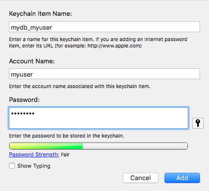

Connecting to a database to read and write data is a common task in R.  Usually, a password is required to create the database connection, however typing plain text passwords into R scripts is poor practice.  The keyringr package uses the operating system's encryption features to supply credentials to R.  Windows (via the Windows Data Protection API), OSX (via Keychain) and Linux (via the Gnome Keyring) are supported.

The package defines three functions - one for each supported OS:

  * Windows - `decrypt_dpapi_pw(file)`
  * Linux - `decrypt_gk_pw(key_value_pairs)`
  * OSX - `decrypt_kc_pw(label, type = "generic")`

A detailed explanation of how to use each function will be given in the following sections, but a simple example of how one would use these functions is provided below.

```{r eval=FALSE}
# without keyringr - password saved in R code.
odbcDriverConnect("driver={SQL Server};server=myDbServer.mycompany.com;database=mydb;uid=myuser;pwd=P@ssw0rd")

# Better approach (windows):
#   Using decrypt_dpapi_pw, we can supply a file containing an encrypted string.
odbcDriverConnect(paste0("driver={SQL Server};server=myDbServer.mycompany.com;database=mydb;uid=myuser;pwd=", decrypt_dpapi_pw("myEncryptedPw.txt")))
```


## Windows
The Windows Data Protection API is used as the backend for `decrypt_dpapi_pw()`.  The steps required to define and use an encrypted password are:

  1.  Run the following command from a Powershell prompt with Administrator privleges:
    
```{Powershell}
Set-ExecutionPolicy RemoteSigned
```
  
  2. Save the following code to a file named _EncryptString.ps1_:
  
```{Powershell}
# Create directory user profile if it doesn't already exist.
$passwordDir = "$($env:USERPROFILE)\DPAPI\passwords\$($env:computername)"
New-Item -ItemType Directory -Force -Path $passwordDir
    
# Prompt for password to encrypt
$account = Read-Host "Please enter a label for the text to encrypt.  This will be how you refer to the password in R.  eg. MYDB_MYUSER"
$SecurePassword = Read-Host -AsSecureString  "Enter password" | convertfrom-securestring | out-file "$($passwordDir)\$($account).txt"
    
# Check output and press any key to exit
Write-Host "Press any key to continue..."
$x = $host.UI.RawUI.ReadKey("NoEcho,IncludeKeyDown")
```

  3. Execute the Powershell script above and give your password an appropriate label.  If you have many connections you will be creating, it's best to use a consistent naming convention, such as "MYDB_MYUSER".  Enter the password to be encrypted.  This example assumes the label given is "MYDB_MYUSER" and the password is "P@ssword".  The file containing the encrypted text will be saved in `%USER_PROFILE%\DPAPI\passwords\[computer name]\MYDB_MYUSER.txt`.

  4. Now you are ready to use the `decrypt_dpapi_pw()` function.  Executing the following commands will print the password to the console:
  
```{r, eval=FALSE}
# build up path to password
credential_label <- "MYDB_MYUSER"
credential_path <- paste(Sys.getenv("USERPROFILE"), '\\DPAPI\\passwords\\', Sys.info()["nodename"], '\\', credential_label, '.txt', sep="")
mypwd <- decrypt_dpapi_pw(credential_path)
print(mypwd)
```

Rather than retrieving and storing the password in a variable, it is better to use the the `decrypt_dpapi_pw` function inline.

## OSX
In keyringr, Keychain is used to supply passwords to R in OSX.  Therefore, entries must first be defined in Keychain prior to using the `decrypt_kc_pw` function.  Again, it is beneficial to use a consistent naming convention - in this example I am using mydb_myuser



Once a password has been saved in Keychain, it can be retrieved from within R as follows:

```{r, eval=FALSE}
mypwd <- decrypt_kc_pw("mydb_myuser")
print(mypwd)
```

Note:  The first time that `decrypt_kc_pw` is used to retrieve a password, OSX asks the user whether to allow or deny access to the Keychain.  There is also a third option "Always Allow".  If you would like your scripts to run without this prompt in the future, ensure that you click "Always Allow".

## Linux
Linux systems with the Gnome Keyring installed can also be used as a back end for keyringr.  The libsecret-tools package must also be installed:

```{r, engine='bash', eval=FALSE}
# Ubuntu 16.04 command
sudo apt install libsecret-tools
```

Password can be saved to the Gnome Keyring using the secret-tool command:

```{r, engine='bash', eval=FALSE}
secret-tool store --label=mylabel db mydb user myuser
```

Note that any combination of key-value pairs can be used to identify an entry in the keyring.

The password defined above can be retrieved from within R by calling the `decrypt_gk_pw` command, which takes the string of key-value pairs identifying the password as the only parameter.

```{r, eval=FALSE}
mypwd <- decrypt_gk_pw("db mydb user myuser")
print(mypwd)
```
